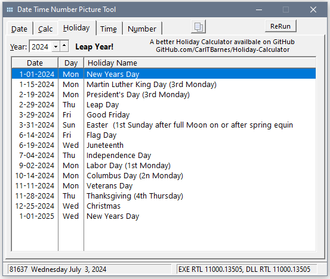

# Date Time Number Tool

Clarion Dates and Times are a bit tricky the way they are stored (Standard Dates and Times) and formatted with @Pictures. This tool lets you test out everything to understand it so the code you write works as expected. You can also try out @N Number, @E Exponent and @P Pattern Pictures.

_____
### Date Tab

Enter a Date and see the Clarion Standard Date (days since 12/27/1800). Displays all Clarion @D Pictures. The list has click sortable headings so you can see them sorted by Date Format with all "D" day based, then "M" Month, then "N" Name and then "Y" Year. Right-click on the list for options to copy the Format or Equate.

The Copy button above the List will place an Equate for the entered date no the clipboard to use in code instead of the DATE() function.
```
Date_7_4_2024  EQUATE(81638)  !20240704  07/04/2024  2024-07-04  04-JUL-2024  Thursday July  4, 2024
```


___
### Date Calculations

Test various calculations using the DATE() function and/or entered dates or date serial numbers. This allows you to verify that passing out of range (Month, Day, Year) values to  DATE() function work as expected.


___
### Holiday Dates

The dates of some common Holidays. A better Holiday Calculator available on GitHub: https://GitHub.com/CarlTBarnes/Holiday-Calculator


___
### Time tab

Enter a Time and see the Clarion Start Times (1/100 seconds since midnight + 1). Displays all Clarion @T Pictures. Right-click on the list for options to copy the Format or Equate.

The Copy button above the List will place an Equate for the entered Time on the clipboard. Clarion has no TIME() function that is similar to the DATE() functions so typical code to get a Standard Time is `DEFORMAT('12:30:00',@t4)`. In the source you will find a `TimeSplit(Time, *? OutHours, ?* OutMinutes, ?* OutSeconds )` function.

```
Time_12:30:00     EQUATE(4500001)     ! 12:30:00  12:30:00PM  123000
```


___
### Number Pictures ... or Any Others @E @P @D @T @S

Try out any @Picture and Value to see how it formats.

You test how DeFromat() works with and without the @Picture for any Value.


The @P @E and @N Number formats syntax is show. These all have tool tips explaining the syntax options.
___
