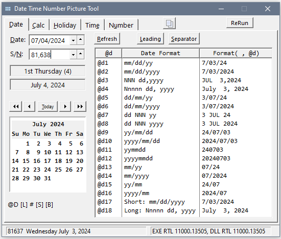
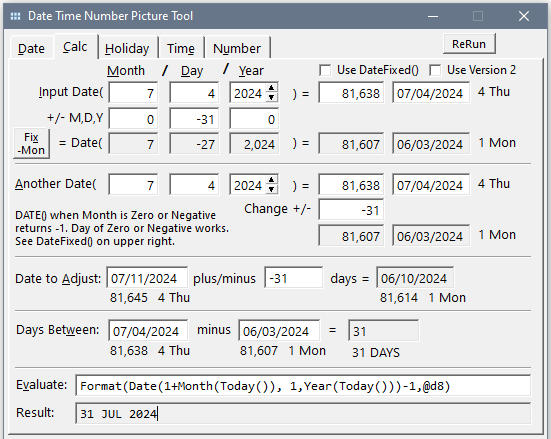

# Date Time Number Tool

Clarion Dates and Times are a bit tricky the way they are stored (Standard Dates and Times) and formatted with @Pictures. This tool lets you test out everything to understand it so the code you write works as expected. You can also try out @N Number, @E Exponent and @P Pattern Pictures.

_____
### Date Tab

Enter a Date and see the Clarion Standard Date (days since 12/27/1800). Displays all Clarion @D Pictures. The list has click sortable headings so you can sort by Date Format. Right-click on the list for options to copy the Format or Equate.

The Copy button above the List will place an Equate for the entered date no the clipboard to use in code instead of the DATE() function.
```
Date_7_4_2024  EQUATE(81638)  !20240704  07/04/2024  2024-07-04  04-JUL-2024  Thursday July  4, 2024
```


___
### Date Calculations

Test various calculations using the DATE() function and/or entered dates or date serial numbers. This allows you to verify that passing out of range (Month, Day, Year) values to  DATE() function work as expected. All calculations show Date Serial Number and formatted Date. All show Day of Week Number (0-6) and Name (Sunday-Saturday) to assist with DOW type formulas e.g. find the first, next, or last Friday.



The DATE(m,d,y) function fails if passed a Month value of Zero or Negative and returns -1. The workaround is to Add Months and Subtract Years. There is a "Fix -Mon" button that explains the calculations.


The screen capture shows subtracting 9 months from 7 will pass -2 months and fail. Instead add 3 months and subtract 1 year.


The formula works for any number of Negative Months e.g. -30 Months can be done as (-30 % 12) = +6 Months Added and (-30+1)/12 -1 ) = -3 Years Subtracted.

```Clarion
DateFixV2  PROCEDURE(LONG _Month,LONG _Day,LONG _Year)!,LONG   !Version 2 for C8 - C11 that fails if Month Zero or Negative
FixMosPositive LONG,AUTO
FixYrsNegative LONG,AUTO
    CODE
    IF _Month <= 0 AND _Year > 1801 THEN    !Month <=0 with Valid Year (can't = 1801 since -1=1800 is invalid and Date(,,1800) returns -1)
       IF _Month < 0 THEN                   !Negative  Month < 0
          FixMosPositive = _Month % 12             !e.g. (-1 % 12) = +11 ; (-9 % 12) = +3  remaining Months of 12
          FixYrsNegative = INT((_Month+1) /12) -1  !This does not need an INT() if assigning to a LONG. an INT() is needed if it were in a Message() or with REAL or DECIMAL
          _Month = FixMosPositive           !Month as + Remaining Months of 12
          _Year += FixYrsNegative           !Make Years Negative  .. possible to be < 1801 but not expecting to work with that old of dates
       END  !FYI "IF _Month=0" may be true if above (Month %12) sets Month=0, so do NOT make below an ELSIF _Month=0
       IF _Month = 0 THEN                   !Date is (0, Days, Valid Year)
          _Month = 12                       !   Month Zero is December
          _Year -= 1                        !      of the Prior Year
       END     
    END     
    RETURN DATE(_Month, _Day, _Year
```
___
### Holiday Dates

The dates of some common Holidays. A better Holiday Calculator available on GitHub: https://GitHub.com/CarlTBarnes/Holiday-Calculator


___
### Time tab

Enter a Time and see the Clarion Start Times (1/100 seconds since midnight + 1). Displays all Clarion @T Pictures. Right-click on the list for options to copy the Format or Equate.

Clarion has no TIME(h,m,s) function so typical code to get a Standard Time is `DEFORMAT('12:30:00',@t4)`. The Copy button above the List will place an Equate for the entered Time on the clipboard like below:

```
Time_12:30:00     EQUATE(4500001)     ! 12:30:00  12:30:00PM  123000
```


At the bottom are Equates for the parts of Time you can copy into your code.
___
### Number Pictures ... or Any Others @E @P @D @T @S

Try out any @Picture and Value to see how it formats two ways: `Format(Value,@Picture)` function and `ENTRY(@Picture)` the screen library. Sometimes there is a difference. One place this is likely is with Any Screen.

You can test how DeFormat() works with and without the @Picture for any Value. Common things to try would be a Date format like @D6 DD/MM/YYYY while no @Picture assumes @D2 MM/DD/YYYY.


The @P @E and @N Number formats syntax is show. These all have tool tips explaining the syntax options.
___

This tool was show during ClarionLive Connect! 2024.07.03 at time 40:50 https://www.youtube.com/watch?v=4zDRPFF8WoE?t=40m50s
